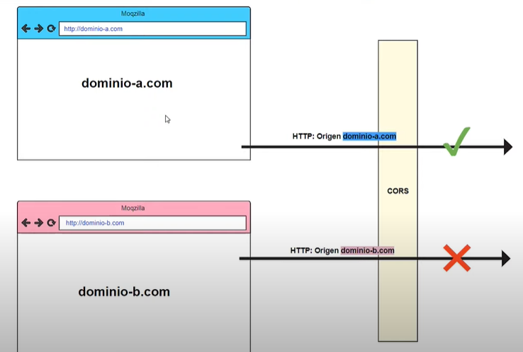

# CORS ( Intercambio de recursos de origen cruzado )

| error muy común al momento de crear aplicaciones

## Control sobre los origenes que tienen acceso a nuestra api

nos permite gestionarlo facilmente con la configuracón de cors

veamoslo ilustrado en una imagen:



## ¿ Cuando aparecen los cors ?

imaginemos que:

- Tenemos un front (vanilla js) que quiere realizar peticiones a una `api`, esta api se comunica con el servidor y extrae datos.

| Sabemos que la api esta corriendo en un puerto especifico ej: 3000

el front va a estar viviendo en `otro origen`, por lo que vamos a tener que `configurar los cors` de nuestra api, dandole acceso a nuestro front.

## Ejemplo de configuración

Veamos uno en código, de una simple configuración de:

entorno de una simple estructura de api con `Express js`

```javascript
const cors = require('cors')
// config
const ACCESOS = [
	"http://test-front:5000"
	"http://other-test-front:5000"
];

```

# Conclusión

los cors son el control (seguridad) del acceso a nuestra api, por tanto a los datos que también esta ofreciendo.
