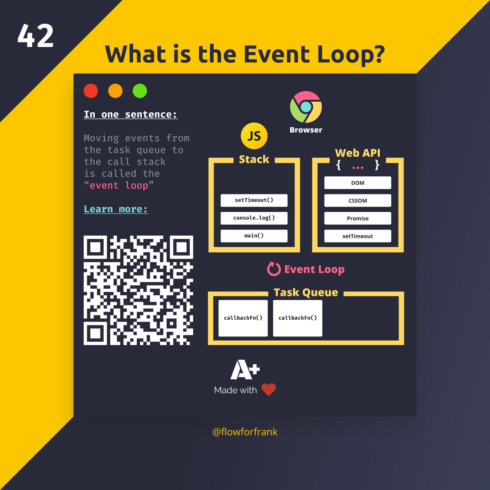

# Porque estudiar javascript ?
Hoy en día javascript es utilizado en una variedad de aplicaciones:
- aplicaciones web
- aplicaciones móviles (mobile)
- aplicaciones de escritorio (desktop)
- aplicaciones backend
- aplicaciones de termimnal

## No es un es un simple lenguaje de scripting

## Paradigmas de programación -> formas de escribir código:
	- procedural
	- funcional
	- imperativo

# Asincronía

# Event Loop

